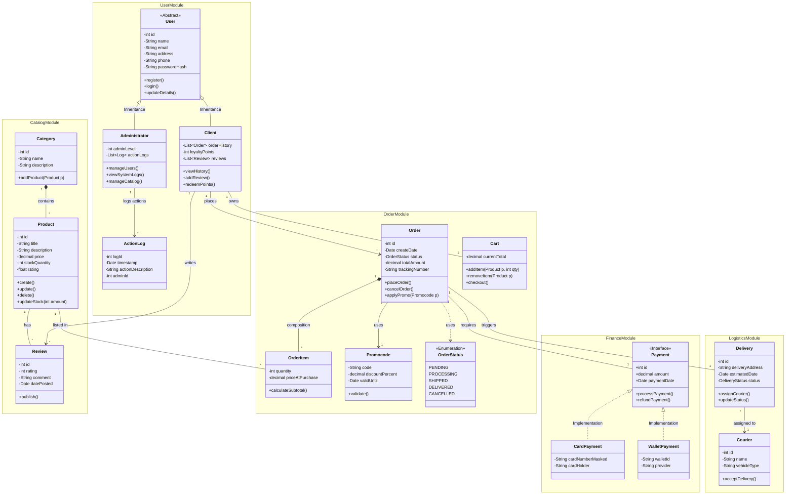

```mermaid
classDiagram
    %% --- ОПРЕДЕЛЕНИЕ КЛАССОВ И МОДУЛЕЙ ---

    namespace UserModule {
        class User {
            <<Abstract>>
            -int id
            -String name
            -String email
            -String address
            -String phone
            -String passwordHash
            +register()
            +login()
            +updateDetails()
        }

        class Client {
            -List~Order~ orderHistory
            -int loyaltyPoints
            -List~Review~ reviews
            +viewHistory()
            +addReview()
            +redeemPoints()
        }

        class Administrator {
            -int adminLevel
            -List~Log~ actionLogs
            +manageUsers()
            +viewSystemLogs()
            +manageCatalog()
        }
        
        class ActionLog {
            -int logId
            -Date timestamp
            -String actionDescription
            -int adminId
        }
    }

    namespace CatalogModule {
        class Product {
            -int id
            -String title
            -String description
            -decimal price
            -int stockQuantity
            -float rating
            +create()
            +update()
            +delete()
            +updateStock(int amount)
        }

        class Category {
            -int id
            -String name
            -String description
            +addProduct(Product p)
        }

        class Review {
            -int id
            -int rating
            -String comment
            -Date datePosted
            +publish()
        }
    }

    namespace OrderModule {
        class Order {
            -int id
            -Date createDate
            -OrderStatus status
            -decimal totalAmount
            -String trackingNumber
            +placeOrder()
            +cancelOrder()
            +applyPromo(Promocode p)
        }

        class OrderItem {
            -int quantity
            -decimal priceAtPurchase
            +calculateSubtotal()
        }

        class Cart {
            -decimal currentTotal
            +addItem(Product p, int qty)
            +removeItem(Product p)
            +checkout()
        }

        class Promocode {
            -String code
            -decimal discountPercent
            -Date validUntil
            +validate()
        }
        
        class OrderStatus {
            <<Enumeration>>
            PENDING
            PROCESSING
            SHIPPED
            DELIVERED
            CANCELLED
        }
    }

    namespace FinanceModule {
        class Payment {
            <<Interface>>
            +int id
            +decimal amount
            +Date paymentDate
            +processPayment()
            +refundPayment()
        }

        class CardPayment {
            -String cardNumberMasked
            -String cardHolder
        }

        class WalletPayment {
            -String walletId
            -String provider
        }
    }

    namespace LogisticsModule {
        class Delivery {
            -int id
            -String deliveryAddress
            -Date estimatedDate
            -DeliveryStatus status
            +assignCourier()
            +updateStatus()
        }

        class Courier {
            -int id
            -String name
            -String vehicleType
            +acceptDelivery()
        }
    }

    %% --- ОТНОШЕНИЯ (RELATIONSHIPS) ---

    %% Наследование
    User <|-- Client : Inheritance
    User <|-- Administrator : Inheritance
    Payment <|.. CardPayment : Implementation
    Payment <|.. WalletPayment : Implementation

    %% Ассоциации Пользователей
    Administrator "1" --> "*" ActionLog : logs actions
    Client "1" --> "*" Order : places
    Client "1" --> "*" Review : writes
    Client "1" -- "1" Cart : owns

    %% Ассоциации Товаров
    Category "1" *-- "*" Product : contains
    Product "1" -- "*" Review : has
    Product "1" -- "*" OrderItem : listed in

    %% Ассоциации Заказов
    Order "1" *-- "*" OrderItem : composition
    Order "*" --> "1" Promocode : uses
    Order "1" -- "1" Payment : requires
    Order "1" -- "1" Delivery : triggers
    Order ..> OrderStatus : uses

    %% Ассоциации Логистики
    Delivery "*" --> "1" Courier : assigned to
```

    
