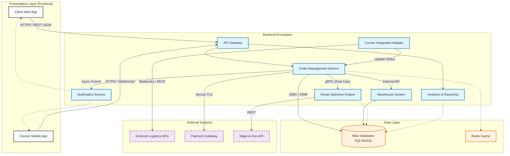

API Gateway: Единая точка входа для всех запросов. Отвечает за маршрутизацию, безопасность (аутентификация) и балансировку нагрузки. Скрывает сложность микросервисов от фронтенда.

Order Management Service (Ядро): Центральный компонент. Управляет жизненным циклом заказа (создан -> оплачен -> собран -> передан курьеру -> доставлен).

Route Optimizer Engine: Математический модуль. Принимает список адресов и параметров груза, возвращает оптимальный маршрут. Вынесен отдельно, так как требует больших вычислительных ресурсов.

Courier Integration Adapter: Слой абстракции для общения с внешними курьерскими службами (DHL, FedEx, локальные курьеры). Преобразует внутренние форматы данных системы в форматы внешних API.

Warehouse System: Отвечает за учет остатков (SKU), бронирование товара под заказ и формирование накладных на сборку.
