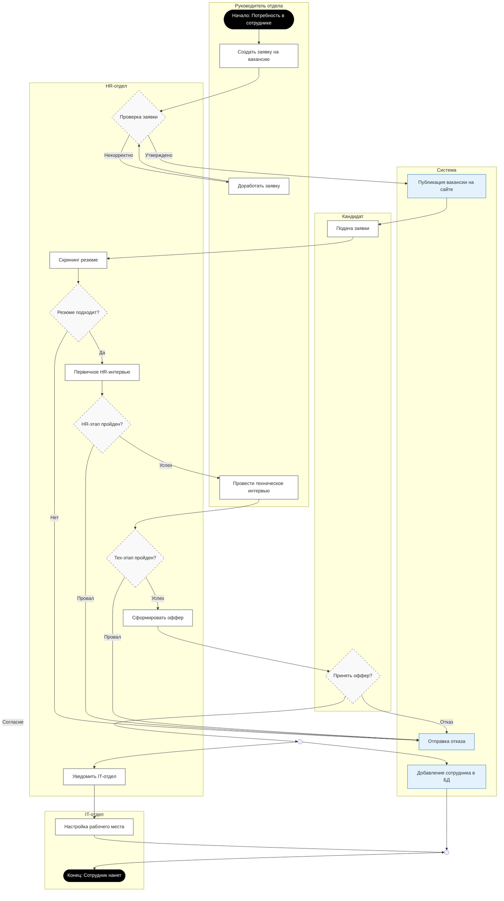

Участники и зоны ответственности:
Руководитель отдела: Инициатор процесса. Отвечает за формулирование требований (заявка) и оценку профессиональных навыков (техническое интервью).
HR-отдел: Главный оператор процесса. Выполняет роль фильтра (проверка заявки, скрининг резюме, первичное интервью) и координатора (оффер, уведомление смежных отделов).
Система: Автоматический исполнитель рутинных операций (публикация, рассылка отказов, регистрация в БД).
Кандидат: Внешний участник, действия которого (подача заявки, принятие решения) запускают следующие этапы системы.
IT-отдел: Сервисная функция, подключающаяся на финальном этапе для обеспечения инфраструктуры.

Ключевые точки принятия решений (Ветвления):
Валидация заявки: Циклическая проверка. Если заявка некорректна, процесс возвращается к Руководителю на доработку.
Скрининг и Интервью: Каскадная система фильтров. Отказ на любом этапе (резюме, HR, Тех) ведет к единому действию системы — "Отправка отказа", что упрощает логику.
Принятие оффера: Финальное решение кандидата определяет, будет ли запущен процесс найма или процесс завершится неудачей.

Параллелизация (Fork/Join): В финальной стадии, после принятия оффера, процесс разделяется на два независимых потока:
Юридическое/Цифровое оформление (Добавление в БД).
Физическое обеспечение (Настройка рабочего места IT-отделом). Процесс считается полностью завершенным только после выполнения обеих задач (синхронизация в точке Join).
