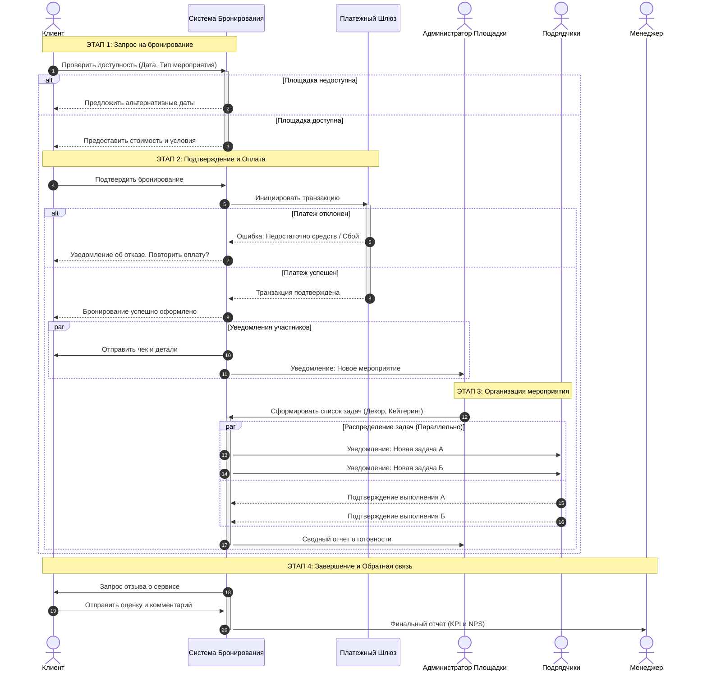

Основные сценарии и ветвления (alt):
Проверка доступности: Система делает синхронный запрос к базе данных (внутри себя). Если слот занят, сценарий предлагает альтернативу, иначе — переходит к оплате.
Обработка платежа: Критическая точка. Взаимодействие с внешним Платежным Шлюзом.
Успех: Запускает цепочку параллельных уведомлений и переводит статус заказа в "Активен".
Провал: Система возвращает управление Клиенту для повторной попытки, не создавая задач для Администратора.

Параллельные процессы (par):
Уведомления после оплаты: Система одновременно отправляет подтверждение Клиенту и наряд Администратору, чтобы минимизировать время ожидания.
Работа с подрядчиками: Самый сложный блок. Рассылка задач разным подрядчикам (декораторам, кейтерингу) и получение от них ответов происходит асинхронно и независимо друг от друга. Система агрегирует эти ответы перед отправкой отчета Администратору.
